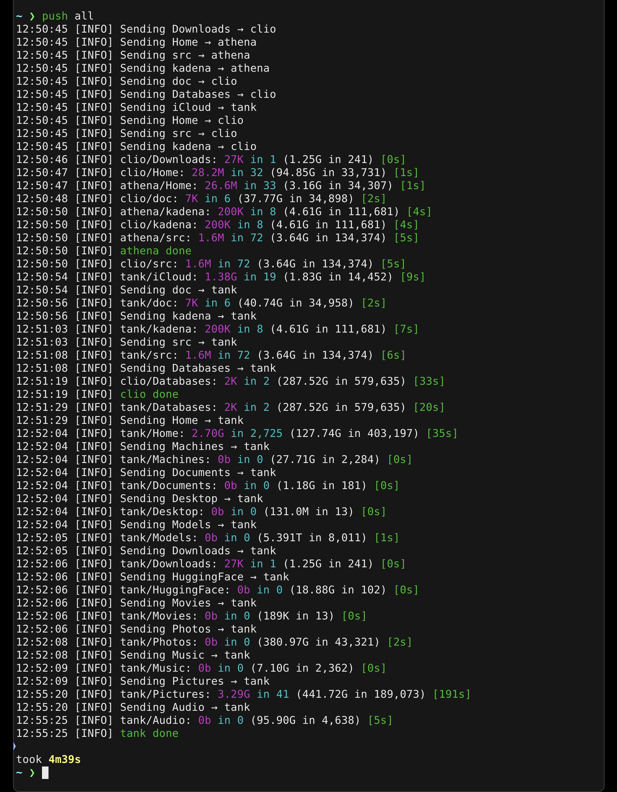

# pushme v3.0.0



[pushme](https://github.com/jwiegley/pushme) is a wrapper around
[rsync](https://en.wikipedia.org/wiki/Rsync) allowing declarative filesets to
be transferred between machines. The screenshot above shows pushme in action
(where `push` is a script I use to call `pushme` with appropriate arguments
based on which machine I'm running it from).

As each destination completes, pushme displays a color-coded completion message
(e.g., `athena done` in green) so you can track progress across multiple
parallel transfers.

## Configuration

Filesets are declared, one per file, in the directory
`~/.config/pushme/filesets`. An exhaustive set of options are given in the
following `src.yaml` example:

```yaml
# Filesets can be specifically named using -f name1,name2,…
Name:     'src'
# Filesets are transmitted in priority order (lower number = higher priority)
# Default priority is 1000 if not specified
Priority: 50
# Classes allow transferring subsets using -c class1,class2,…
Classes:
  - 'small'

# Define on which machines the fileset is located, where, and if custom
# rsync options apply
Stores:
  hera:
    # The remote pathname on `hera` where this fileset resides
    Path: /Users/johnw/src

    # Filters passed to rsync whenever transferring TO `hera`
    # Uses rsync filter syntax (see Filter Syntax section below)
    Filters: |
      - *~
    # If NoBasicOptions is set, then `-a` is not passed to `rsync`
    NoBasicOptions: false
    # If NoDelete is set, then `--delete` is not passed to `rsync`
    NoDelete: true
    # If PreserveAttrs is set, then `-AXUNHE` is passed to `rsync`. This is
    # not the default.
    PreserveAttrs: true
    # If ProtectTopLevel is set, top-level items are protected from deletion
    # (implemented as --filter "P /*" passed to rsync). This prevents --delete
    # from removing any files/directories at the root level of the destination.
    ProtectTopLevel: false
    # Additional `rsync` options added, in addition to any others.
    Options:
      - "--delete-after"
    # Only transfer here if we are transferring FROM the given machines.
    ReceiveFrom:
      - clio
    # Is this fileset active on this machine? If not, never transfer here.
    # Default is true if not specified.
    Active: true

  clio:
    Path: /Users/johnw/src
    ReceiveFrom:
      - hera

  athena:
    Path: /Users/johnw/src
    ReceiveFrom:
      - hera
      - clio

  # `tank` is the same machine as `athena`, it just uses a different set of
  # platter-based directories for long-term, ZFS archival storage. By using a
  # separate ssh hostname to refer to `athena` this way, I gain additional
  # flexibility as to which filesets get transferred and how much parallelism
  # is used when receiving files (to reduce fragmentation)
  tank:
    Path: /tank/src
    ReceiveFrom:
      - hera
      - clio

# In addition to specifying specific options for given targets above, you can
# also specify options here that apply to all targets. Note that each setting
# here may be overridden by target specific settings or command-line options.
Common:
  Filters: |
    # Exclude common build artifacts and temporary files
    - *.agdai
    - *.d
    - *.glob
    - *.hi
    - *.o
    - *~
    - dist/
    - dist-newstyle/
    - node_modules/
```

### Filter Syntax

Filters use standard rsync filter rule syntax. Despite being passed via
`--include-from`, patterns can be both includes and excludes. Key points:

- **`- pattern`** excludes files matching pattern
- **`+ pattern`** includes files (when combined with excludes)
- **`*`** matches any characters except `/`
- **`**`** matches any characters including `/`
- Patterns starting with **`/`** are anchored to the source directory root
- **First matching rule wins**
- See `man rsync` FILTER RULES section for complete details

**Simple exclude examples:**

```yaml
Filters: |
  - *~              # Exclude backup files
  - *.o             # Exclude object files anywhere
  - /dist/          # Exclude dist/ in root directory only
  - /.cache/        # Exclude .cache/ in root only
  - **/.git/        # Exclude .git/ directories anywhere
```

**Advanced include/exclude example:**

```yaml
Filters: |
  # Include foo directory, but only some of its children
  + /foo/
  + /foo/bar
  - /foo/*          # Exclude all other files in /foo
  - /foo/*/         # Exclude all other directories in /foo
  - /foo/.*         # Exclude hidden files in /foo
  - /foo/.*/        # Exclude hidden directories in /foo
```

## Usage

Once you have defined a group of filesets, you may transfer all filesets that
apply from one machine to any others using the basic command:

    pushme SOURCE TARGETS…

For example, I have a desktop `hera`, a laptop `clio`, a server `athena` and a
ZFS drive on `athena` that I reference using the ssh hostname `tank`. Thus I
might use any of the following commands:

    pushme hera clio                # update the laptop
    pushme hera clio athena         # update the laptop and server
    pushme hera clio athena tank    # update both and archival store

### Parallelism

If a machine has multiple cores, you can take advantage of parallelism by
specifying how many simultaneous transfer jobs you'd like to support either
from or to a particular machine:

    pushme hera@24 clio@14 athena@10 tank@1

Filesets are always transferred in priority order (lower numbers first),
independent of how many times a particular fileset may be "in flight" at a
given moment when transferring to multiple machines. This should ensure that
the most important data is always completed first, before transferring other
filesets.

As transfers to each destination complete, pushme displays a completion message
(e.g., `athena done` in green by default).

## Global Configuration

In addition to setting rsync options per-target or common to all targets within
a fileset, you may also define global options using
`~/.config/pushme/config.yaml`:

```yaml
# If DryRun is true, no changes will be made to any target fileset
DryRun: false
# If Filesets is defined here, only these filesets are eligible for transfer
Filesets:
  - 'foo'
# If Classes is defined here, only matching filesets are eligible for transfer
Classes:
  - 'foo'
# If SIUnits is true, report in gigabytes, for example, instead of gibibytes
SIUnits: true
# If Verbose is true, present a great amount of detail
Verbose: false
# If NoColor is true, disable ANSI color codes in output
NoColor: false
# GlobalOptions are like having a Common block in every fileset
GlobalOptions:
  PreserveAttrs: true
  Options:
    - "--include-from=/Users/johnw/.config/ignore.lst"
```

## Command-Line Options

Options may also be specified using the command-line:

| Short | Long | Description |
|-------|------|-------------|
| | `--config DIR` | Config directory (default: `~/.config/pushme`) |
| `-n` | `--dry-run` | Do not take any actions, just report what would happen |
| `-f` | `--filesets LIST` | Comma-separated list of filesets to transfer |
| `-c` | `--classes LIST` | Comma-separated list of classes to transfer |
| `-s` | `--si-units` | Use 1000 instead of 1024 as divisor (GB vs GiB) |
| `-v` | `--verbose` | Report progress verbosely (show full rsync output) |
| | `--no-color` | Disable ANSI color codes in output |
| | `--rsync-filters TEXT` | rsync filter rules to apply globally |
| | `--rsync-no-basic-options` | Do not pass `-a` to rsync |
| | `--rsync-no-delete` | Do not pass `--delete` to rsync |
| | `--rsync-preserve-attrs` | Pass `-AXUNHE` to rsync (preserve all attributes) |
| | `--rsync-protect-top-level` | Protect top-level items from deletion |
| | `--rsync-options LIST` | Space-separated list of options to pass to rsync |

**Examples:**

```bash
pushme --dry-run hera athena
pushme -f src,Documents -v hera clio
pushme --no-color hera athena
pushme --rsync-options "--delete-after --partial" hera clio
```

## Configuration Precedence

When the same option is specified in multiple places, pushme uses the following
precedence order (highest to lowest):

1. **Target-specific options** (in fileset's `Stores.<hostname>` section)
2. **Command-line options** (merged with fileset Common)
3. **Fileset Common** (in fileset's `Common` section)
4. **GlobalOptions** (in `config.yaml`)
5. **Built-in defaults**

### Merging Behavior

Options are merged using the following rules:

- **For Maybe fields** (Filters, Options, ReceiveFrom): Right side wins (later
  definition completely overrides earlier one)
- **For Boolean flags** (NoDelete, PreserveAttrs, etc.): `true` wins if set
  anywhere (OR logic)
- **For Active flag**: Both must be `true` (AND logic)

**Example:** If you specify `Options` in both GlobalOptions and a target-
specific store, only the target-specific Options will be used. They are not
concatenated.

## Output Format

In non-verbose mode (default), pushme displays summary statistics for each
transfer:

```
Sending src → athena: 42.3M in 127 (1.2G in 1,234) [8s]
```

This shows:
- **42.3M** - actual data transferred (after compression/rsync delta)
- **127** - number of files transferred
- **1.2G** - total size of all files examined
- **1,234** - total number of files examined
- **[8s]** - time taken in seconds

With `--verbose`, full rsync output is displayed instead.

With `--no-color`, ANSI color codes are disabled (useful for logging or
terminals that don't support colors).

## Troubleshooting

### See what would be transferred without making changes

Use `--dry-run` to see what would be transferred without making any changes:

```bash
pushme --dry-run hera athena
```

### Debug transfer issues

Use `--verbose` to see detailed rsync output including which files are being
transferred:

```bash
pushme --verbose hera clio
```

With verbose mode, filter rules are also logged before each transfer.

### Color output appears as garbage

If ANSI color codes appear as garbage characters in your terminal or logs, use
`--no-color`:

```bash
pushme --no-color hera athena
```

Or set `NoColor: true` in `~/.config/pushme/config.yaml`.

### Filter rules not working as expected

1. Use `--verbose` to see the filter rules being passed to rsync
2. Test filter rules with rsync directly: `rsync -avn --include-from=filters.txt src/ dest/`
3. Remember that first matching rule wins
4. Check if patterns need to be anchored with `/` prefix

### No filesets found error

Ensure filesets are defined in `~/.config/pushme/filesets/*.yaml` (or your
custom config directory). Each fileset should have a `.yaml` extension.

## Building from Source

Using Nix (recommended):

```bash
nix develop    # Enter development shell
nix build      # Build the project
```

Using Cabal:

```bash
cabal build
cabal run pushme -- hera athena
```

## License

Copyright (C) 2025 John Wiegley
BSD3 License - see LICENSE file for details
